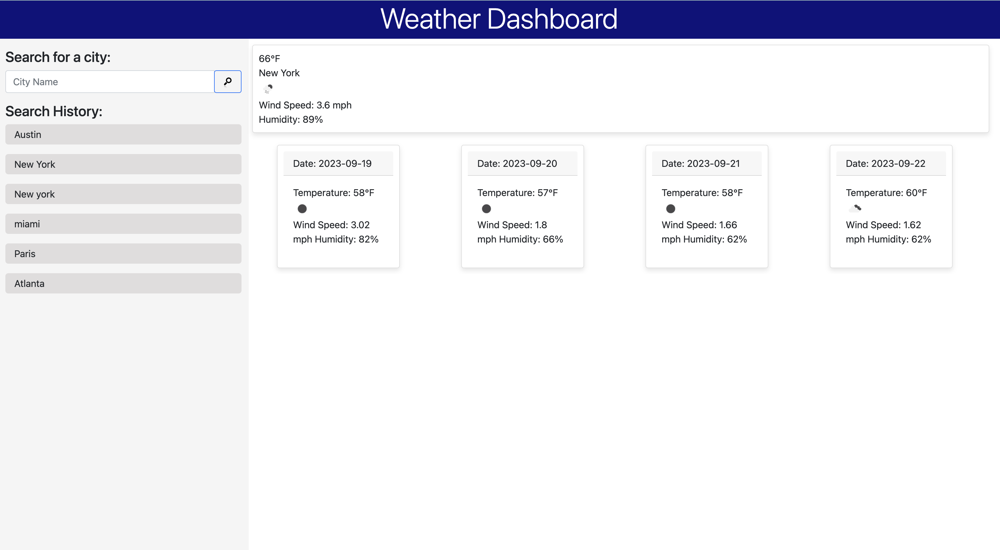

# Weather Tracker App

## Description

The Weather Tracker App is designed to provide real-time weather updates for various cities across the world.

- **Motivation**: The uncertainty of weather conditions can greatly affect daily life and plans. We wanted a tool that provides quick and accurate weather information.
- **Why**: We built this project to help people plan their day better, knowing if they might need an umbrella, sunscreen, or a winter jacket.

## Table of Contents

- [Installation](#installation)
- [Usage](#usage)
- [Credits](#credits)
- [License](#license)

## Installation

1. Clone the repository https://github.com/charleshuurman/weathertracker.git to your local machine.

## Usage

Once the server is running, navigate to https://charleshuurman.github.io/weathertracker/ in your browser.

- Enter the city name in the search bar.
- Press 'Search' to display current weather conditions and a 5-day forecast.
- Your search history is saved and can be accessed for quicker results in the future.

## Credits

Special thanks to the [OpenWeather API](https://openweathermap.org/api) for providing weather data.

## License

MIT License. For more detail

---

## Badges

## Features

- **Real-time Weather Data**: Fetches current weather conditions.
- **5-Day Forecast**: Provides a forecast for the next five days.
- **Search History**: Saves previously searched cities for quick access.
- **Responsive Design**: Works seamlessly across desktop, tablet, and mobile devices.
